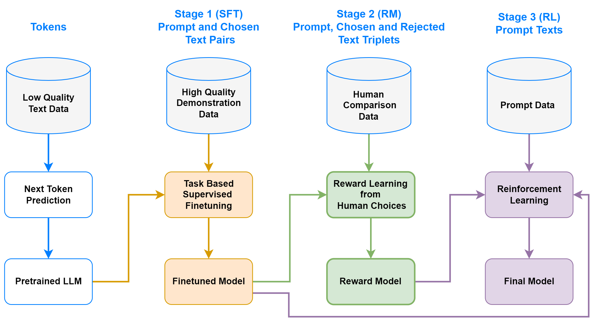

# ⚡ SheepRLHF 🐑

## :open_book: What

An easy-to-use framework for training large language models with reinforcement learning in `PyTorch`, accelerated with [Lightning Fabric](https://lightning.ai/docs/fabric/stable/).  The framework is designed to be modular and extensible. It supports different RL algorithms, different tasks, and different datasets.

### Quick start

```bash
git clone https://github.com/Eclectic-Sheep/sheeprlhf.git && cd sheeprlhf
pip install -e "."
# Launch SFT training for summarization task using OPT model using Lightning Fabric on GPU
python sheeprlhf.py train data=summarization model=opt task=sft fabric=auto_cuda
# Optionally
pip install -e ".[eval]"
python sheeprlhf.py eval task=perplexity experiment_dir=<path_to_sft_experiment>
```

This will train a model on the summarization dataset using the [OPT](https://huggingface.co/facebook/opt-350m) model. The training will first download the dataset and the model, and then start training. The training will be accelerated with Lightning Fabric, and all metrics will be logged locally using [TensorBoard](https://www.tensorflow.org/tensorboard).

### Configurations

Here is the available configurations out-of-the-box for the framework:

| Dataset Name |  Config Name |
|--------------|-------------|
| [CarperAI/openai_summarize_comparisons](https://huggingface.co/datasets/CarperAI/openai_summarize_comparisons)| summarization|
| [Dahoas/full-hh-rlhf](https://huggingface.co/datasets/Dahoas/full-hh-rlhf) | helpful_harmless |


| Model Name | Config Name |
|------------|-------------|
| [OPT](https://huggingface.co/facebook/opt-350m) | opt |
| [GPT2](https://huggingface.co/gpt2) | gpt2 |
| [Phi](https://huggingface.co/microsoft/phi-1_5) | phi |

| Train Task Name              | Config Name |
|------------------------------|-------------|
| Supervised Fine-Tuning       | sft         |
| Reward Modeling              | rm          |
| Proximal Policy Optimization | ppo         |
| Direct Policy Optimization   | dpo         |


| Evaluation Task Name | Config Name |
|----------------------|-------------|
| Perplexity           | perplexity  |
| ROUGE                | rouge       |


## :question: Why

We want to have a framework for RL algorithms for LLMs starting from common RLHF algorithms that is at the same time simple and scalable thanks to Lightning Fabric framework. Single framework for different type of tasks and algorithms, should allow developers to easily experiment with different configurations.

## :pencil: How

<p align="center">
  
</p>

Reinforcement Learning with Human Feedback (RLHF) is a technique that combines traditional reinforcement learning (RL) with human decisions to train more effective and safe policies. Instead of solely relying on reward signals obtained from the environment, RLHF integrates feedback from humans to guide the learning process. With RLHF, we can have approximated reward signals that are not crafted manually, but rather learned from human judgments. Moreover, we have implemented Direct Policy Optimization for aligning models to human preferences without training a reward model.

### Usage

`SheepRLHF` is designed to be modular and extensible. The framework provides two entry points: `train` and `eval`. The `train` entry point is used to train a model, while the `eval` entry point is used to evaluate a model. After selecting the entry point, the user can select the task, the model, and the data to use. All other configurations can be changed by passing them as command line arguments.

### Extending the framework

The repository is structured as follows:

- `agent`: Contains the implementation of the agents for RL algorithms.
- `config`: Contains the default configurations for entry points or experiments.
- `data`: Contains the implementation of the data processors that can be extended to support new datasets. It also includes dataset and data collator implementations.
- `loss`: Contains the implementation of the loss functions for available tasks.
- `model`: Contains the implementation of wrapper model classes for LLMs.
- `structure`: This folder has all configurations for the framework, including the default configurations. The user can add new settings to the framework by adding new configurations to this folder.
  - `data.py`: Contains the configuration for each dataset available.
  - `fabric.py`: Configurations for Lightning Fabric instance.
  - `generation.py`: Contains parameters for generation configuration for text generation.
  - `model.py`: Contains the configuration for each model available.
  - `optim.py`: Optimization configuration.
  - `run.py`: Entry point configurations for training and evaluation.
  - `task.py`: Contains the configuration for each task available such as SFT, DPO, and PPO etc.
- `task`: In this folder, we have implementations for each task that the framework supports.
    - `train`: Contains the implementation of the training algorithms such as SFT, DPO, and PPO.
    - `eval`: Contains the implementation of the evaluation algorithms such as perplexity and and ROUGE.
- `utils`: Contains utilities and helper functions.
- `cli.py`: Contains the entry points for the framework.

### Adding new models

All models are defined as `configuration dataclasses` under `sheeprlhf/structure/model.py` file.To add a new model available on `Huggingface`, one can add a new configuration to the file. For example, to add OPT 350M model, one can add the following code:

```python
@dataclass
class OPTConfig(ModelConfig):
    """Configurations for OPT based models."""
    config_name: str = "opt"
    repo_name: str = "facebook/opt-350m"
    embedding_dim_name: Optional[str] = "word_embed_proj_dim"
    lora_cfg: Optional[LORAConfig] = LORAConfig(targets="('q_proj','v_proj')")
```

### Enabling LoRA

`SheepRLHF` supports LoRA out of the box, which helps reducing memory requirements while only updating the subset of parameters. To enable LoRA, one can add the following code to the configuration of the algorithm:

```bash
python sheeprlhf.py train task=sft model=opt data=summarization model.finetune_mode=LORA model.lora_cfg.rank=16

```

## :bow: Contributing

The best way to contribute is by opening an issue to discuss a new feature or a bug, or by opening a PR to fix a bug or to add a new feature. For development, it is required to install the pre-commit hooks and have development dependencies installed. To do so, run the following commands:

```bash
pip install ".[dev]"
pre-commit install
```

## :information_source: Acknowledgements

This work and the code developed for the task is a long educational and experimental journey. Please ask us about anything you need or not clear on GitHub. It will be even more then welcomed if you like to contribute. We would like to thank the following works for their contributions to the field and inspiring us to develop this work.

### Libraries

- [SheepRL](https://github.com/Eclectic-Sheep/sheeprl)
- [TRL](https://github.com/lvwerra/trl)
- [DeepSpeedChat](https://github.com/microsoft/DeepSpeedExamples/blob/master/applications/DeepSpeed-Chat/README.md)
- [TRLX](https://github.com/CarperAI/trlx)
- [Lit-Llama](https://github.com/Lightning-AI/lit-llama)
- [Lit-GPT](https://github.com/Lightning-AI/lit-gpt)
- [MinLora](https://github.com/cccntu/minlora)
- [MOSS-RLHF](https://github.com/OpenLMLab/MOSS-RLHF)
- [DPO Original Project](https://github.com/eric-mitchell/direct-preference-optimization)

### Blog Posts

- [StackLLaMa](https://huggingface.co/blog/stackllama)
- [Implementing RLHF: Learning to Summarize with trlX](https://wandb.ai/carperai/summarize_RLHF/reports/Implementing-RLHF-Learning-to-Summarize-with-trlX--VmlldzozMzAwODM2)
- [RLHF: Reinforcement Learning from Human Feedback](https://huyenchip.com/2023/05/02/rlhf.html)
- [Fine-tune Llama 2 with DPO](https://huggingface.co/blog/dpo-trl)

### Research Articles

- [Learning to summarize from human feedback](https://arxiv.org/abs/2009.01325)
- [Training language models to follow instructions](https://arxiv.org/abs/2203.02155)
- [DeepSpeed-Chat: Easy, Fast and Affordable RLHF Training of ChatGPT-like Models at All Scales](https://arxiv.org/abs/2308.01320)
- [Secrets of RLHF in Large Language Models Part I: PPO](https://arxiv.org/abs/2307.04964)
- [LLAMA 2: Open Foundation and Fine-Tuned Chat Models](https://arxiv.org/abs/2307.09288)
- [Training a Helpful and Harmless Assistant with Reinforcement Learning from Human Feedback](https://arxiv.org/abs/2204.05862)

## :mailbox_with_no_mail: Who

You can contact us for any further questions or discussions:

- Refik Can Malli: refikcan.malli@orobix.com
- Federico Belotti: federico.belotti@orobix.com
- Davide Angioni: davide.angioni@orobix.com
- Michele Milesi: michele.milesi@orobix.com

## :page_facing_up: License

This project is licensed under the terms of the Apache License 2.0. Please see the [LICENSE](LICENSE) file for details. Be aware that the project also may use other third-party libraries or models available online, which may be licensed under different licenses.